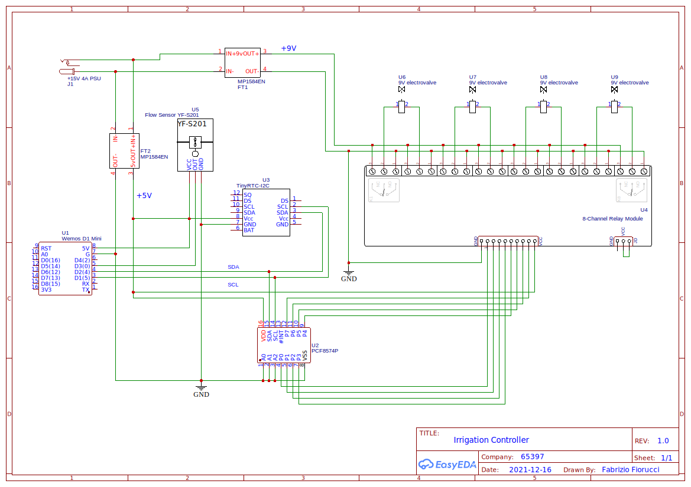

# Irrigation Controller

## Description

This is a Wemos D1-based irrigation controller, main features are:

- support for 4 water lines through bistable 9V valves
- support for one water flow sensor to monitor and measure water consumption
- MQTT used for configuration and monitoring purposes. You will need to set up a MQTT broker (ie. mosquitto)
- Water lines configuration is persistently stored to the Wemos D1 EEPROM and is kept across restarts
- OTA updates are supported

## Sketch

External libraries used:

- RTClib by Adafruit - https://github.com/adafruit/RTClib
- PCF8574 library by Renzo Mischianti - https://www.mischianti.org/2019/01/02/pcf8574_1-i2c-digital-i-o-expander-fast-easy-usage/
- ArduinoJSON by Benoît Blanchon - https://arduinojson.org/

The sketch can be uploaded to the Wemos D1 using Arduino. The "Custom parameters - TO BE EDITED" section must be configured with your own settings

## Hardware bill of materials

- single-sided perfboard 90mm x 80mm
- 1x Wemos D1 Mini
- 2x MP1584EN DC-DC Converter Step Down Voltage Regulator Module (ie. https://www.aliexpress.com/item/4000016331112.html)
- 1x YF-S201 Water Flow Sensor
- 1x TinyRTC I2C module (https://www.openhacks.com/uploadsproductos/tiny_rtc_-_elecrow.pdf)
- 1x PCF8574P 8-bit I2C I/O expander
- 1x 8-channel Relay Module
- 4x 100Ohm 1/4W resistor
- 4x 0.1uF capacitor
- 1x Power supply, 12v to 28v, 4A
- 4x 9v bistable water valves

## Schematics

The Irrigation Controller can be powered by a power supply ranging from 12v to 28v, 4A. Two DC/DC buck converters are used to:

- provide +5v to power the Wemos D1 and main board
- provide +9v to power the water valves

## Usage

For supported commands and usage details see the [usage page](/USAGE.md)
